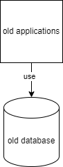

# Disclaimer

This source code has been released as open source with the permission of its owner – KUK Electronic AG, based in Switzerland. The code is provided "as is", without any warranties of any kind, either express or implied, including but not limited to the implied warranties of merchantability, fitness for a particular purpose, or non-infringement.

To the maximum extent permitted by applicable law, the authors, the code owner, and any contributors shall not be held liable for any damages, losses, or claims arising from the use of, inability to use, modification, or distribution of this software – regardless of the legal theory under which such claims are brought.

Use of this code is entirely at your own risk. It is strongly recommended to review and test the code thoroughly to ensure it meets your needs and complies with applicable laws before use.

This project is not affiliated with any existing products or companies using the same name in unrelated industries.

# General information

This application is aimed at helping with migration from old database to new database where we need to maintain bidirectional synchronization between two different schemas.

# Migration logic

Let's assume we have one old database and set of old applications using old schema. We want to move them to new schema and new microservices. However, that ideally should not happen at once. We want to be able to move some of the data (selected tables) from old schema to new schema, transforming the schemas to new structure that is better designed. We also want users to be able to use both old applications using old schema and new applications using new schema at the same time. It means that data from old schema needs to be synchronized in real time with data in new schema and vice versa (from new to old as well). Once part of the solution is migrated to new schema and new applications, we want to do next parts. After the whole old schema is transformed to new schema and all old applications are rewritten to new applications, the old schema and old applications can be abandoned.

# Proposed solution

This is proof of concept (PoC) application that shows it is possible to design an application that realises this scenario. It is developed with Docker (so that anyone can run application in the same way on different machines), C# (for application that transforms old schema to new schema and vice versa), MySQL 8.0 (as source database), Postgres (as destination database) and Debezium (which monitors database change logs - binlog in MySQL and WAL in PostgreSQL). It also provided Online mode which you can adjust to do the same with services in the cloud, rather than just with Docker.

# Diagrams

---

The following is our **current situation**:\
\


---

The following is our **desired (intermediate) situation**:\
\


---

The following is our **desired (destination) situation**:\
\


---

The following is how our **proof of concept application** currently works (it is oversimplified diagram):\
\


---

# Task statement

We have old database in MySQL 8.0. It is being used by old applications.
We want to have new database in Postgres in the cloud that will be used by new applications.
During transition phase, we want to:
1. Create preprod database that will be one-to-one copy of old database, synchronized in real time.
2. Create dev database that will be copy of preprod database created on demand.
3. Create new database that will contain new schema. This new schema will be old schema after significant transformations.
4. Create new applications that will be using new schema.
5. Continue using old applications that use old schema.
6. Make sure that changes from old schema are synchronized with new schema, using transformations. In the same way, transform changes from new schema to old schema.
Dev database will be used for testing and development.

Notice that this PoC does not involve creating preprod or dev databases because this can be achieved using different mechanisms.

# Possible approach

Custom C# application that will help with transformation between schemas was written. First of all, changes are made in proof of concept application with Docker.

Currently there is TestDatabaseSynchronization integration test in C# that works as follows:
1. Quick delete
    a. Remove Kafka-related containers (control-center, connect, schema-registry, kafka)
    b. Remove other containers (mysql80, destinationpostgres, martenpostgres, debezium)
2. Quick startup
    a. Start Kafka-related containers (kafka, schema-registry, connect, control-center)
    b. Start other containers including debezium (mysql80, destinationpostgres, martenpostgres, debezium)
    c. Initialize old database
        i. Initialize old empty schema
        ii. Execute initialization script
            • Create debezium user
            • Grant required permissions to debezium user
            • Create datachanges user
    iii. Import Chinook database from SQL file
    iv. Add test column
    v. Apply cnf file that turns on binlog
    vi. Restart container
    vii. Wait for container to be up
3. Delete processor logs
4. Start C# processor application
    a. Register old-to-new-connector, if it is not registered
    b. Initialize new database with data copied and transformed from old database
    c. Register new-to-old-connector, if it is not registered
    d. Wait for Kafka:OldToNewTopic and Kafka:NewToOldTopic topics to be available
    e. At this point both topics should have been already created by Debezium connectors so the execution continues without any waiting for these topics to be available
    f. Create Kafka client objects that subscribe to both topics
    g. Create Kafka:EventQueueTopic
    h. Start consumer async method
    i. Start processing debezium events method
	
The process in C# application is such that:
1. It reads event from Kafka topics for old or new database. It saves them to Kafka:EventQueueTopic in the order they arrive (using intermediary Kafka topic that acts as a buffer).
2. It reads events from Kafka:EventQueueTopic. It saves events to new or old database (if they come from old or new databases respectively).

# Considerations

1. **Avoiding race conditions.** There may be situation when old application reads the state of some data from old schema, then new application modifies it and finally old application saves data updated based on old values (without modifications done by new application). You may want to use new functionalities only in new applications once they are developed. You may also add checks for current database values just before doing insert, update or delete operations from new applications to new database - that would help on one side but not the other.
2. **Error handling logic in C# application.** Currently we assume failure of the whole application, watching for ping from the application (health check) and informing developers immediately from the cloud that the application has crashed.
3. **Preprod scenario.** We may want to have two additional preprod databases that will be one to one copies of old and new databases respectively. We can create on-demand snapshots from these preprod databases (called dev databases) and use them for development purposes. It may be achieved with JdbcSinkConnector or just on-demand without preprod database. You can also use features available in your cloud provider.
4. **New schema initialization.** At the moment of initializing new database in KafkaProcessor / RunEventProcessingAsync, we may need to have change-freeze on production, for a brief moment, so that we don't have race conditions. We may need to disconnect users from database directly before applying initial migration and re-enable it just after.

# Getting started

You need to create environment variables. You may also place them in docker\.env file. Of course, real passwords should be stronger.

```
DebeziumWorker_Docker_Environment=Development
DebeziumWorker_Docker_NewDatabaseDataChangesPassword=datachangespassword
DebeziumWorker_Docker_NewDatabaseDataChangesUserName=datachanges
DebeziumWorker_Docker_NewDatabaseDebeziumPassword=debeziumpassword
DebeziumWorker_Docker_NewDatabaseRootPassword=rootpassword
DebeziumWorker_Docker_OldDatabaseDataChangesPassword=datachangespassword
DebeziumWorker_Docker_OldDatabaseDataChangesUserName=datachangesuser
DebeziumWorker_Docker_OldDatabaseDebeziumPassword=debeziumpassword
DebeziumWorker_Docker_OldDatabaseRootPassword=rootpassword
DebeziumWorker_Docker_PostgresMartenDatabaseName=martenevents
DebeziumWorker_Docker_PostgresMartenRootPassword=rootpassword
DebeziumWorker_Docker_PostgresMartenRootUserName=root
DebeziumWorker_EnvironmentDestination=Docker
DebeziumWorker_Online_Environment=Staging
DebeziumWorker_Online_KeystorePassword=PLEASE_PROVIDE_YOUR_OWN_VALUE
DebeziumWorker_Online_NewDatabaseDataChangesPassword=PLEASE_PROVIDE_YOUR_OWN_VALUE
DebeziumWorker_Online_NewDatabaseDataChangesUserName=PLEASE_PROVIDE_YOUR_OWN_VALUE
DebeziumWorker_Online_NewDatabaseDebeziumPassword=PLEASE_PROVIDE_YOUR_OWN_VALUE
DebeziumWorker_Online_NewDatabaseRootPassword=PLEASE_PROVIDE_YOUR_OWN_VALUE
DebeziumWorker_Online_OldDatabaseDataChangesPassword=PLEASE_PROVIDE_YOUR_OWN_VALUE
DebeziumWorker_Online_OldDatabaseDataChangesUserName=PLEASE_PROVIDE_YOUR_OWN_VALUE
DebeziumWorker_Online_OldDatabaseDebeziumPassword=PLEASE_PROVIDE_YOUR_OWN_VALUE
DebeziumWorker_Online_OldDatabaseRootPassword=PLEASE_PROVIDE_YOUR_OWN_VALUE
DebeziumWorker_Online_PostgresMartenDatabaseName=PLEASE_PROVIDE_YOUR_OWN_VALUE
DebeziumWorker_Online_PostgresMartenRootPassword=PLEASE_PROVIDE_YOUR_OWN_VALUE
DebeziumWorker_Online_PostgresMartenRootUserName=PLEASE_PROVIDE_YOUR_OWN_VALUE
DebeziumWorker_Online_SchemaRegistryLoginAndPassword=PLEASE_PROVIDE_YOUR_OWN_VALUE
DebeziumWorker_Online_SslKeyPassword=PLEASE_PROVIDE_YOUR_OWN_VALUE
DebeziumWorker_Online_TruststorePassword=PLEASE_PROVIDE_YOUR_OWN_VALUE
```

If you intend to use Online mode, you need to provide your own values in PLEASE_PROVIDE_YOUR_OWN_VALUE. Don't forget to copy and paste certificates to the path indicated by OnlineMode:SslCaLocation, OnlineMode:SslCertificateLocation and OnlineMode:SslKeyLocation, as well as setting parameters in appsetting files.

You may start using the application by installing and starting Docker, using 'docker-compose up -d", "docker-compose down" (to download requried images) and then executing either KUK.ChinookCruds for manual testing or integration tests (starting with basic TestDatabaseSynchronization). Notice that running in either Docker or Online mode is **destructive action**, which means that it removes all the containers (Docker mode) or removes some resources like Debezium connectors (Online mode) before proceeding with the test.

# Configuring the environment

In order to use the application, you need to set up environment variables, create .env file, set appsetting json files in different projects and run the application.

When you run the project from Visual Studio.
Trust and install self-signed certificates generated by ASP.NET Core and IIS Express.

After setting environment variables you need to restart Visual Studio.

Add .env file in .../docker directory. Make sure you don't add .txt extension to the file. It has to be just .env file. Add environment variables with _Docker_ there from the list below.

Run docker-compose up -d from that directory.

If destinationpostgres docker has status 'exited' you can probably find an error in logs:

cannot execute: required file not found

To solve it you need to set EOL characters to LF for initPostgresUsers.sh file.
You can do it in notepad++ by opening the file and then Edit => EOL Conversion => Unix (LF)

# Further information

Please refer to DETAILS.md for further documentation.

# Credits

Developer: Rafał Stybliński (rstyblinski@kuk.ch)
Company: KUK Electronic AG